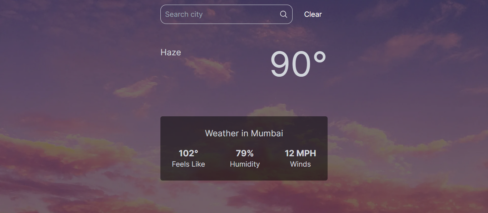

# Weather Wise 

This is a simple weather application built using Next.js and TypeScript. It fetches weather data from the OpenWeatherMap API and displays it based on user input.

## Technologies Used

**Next.js**
: A React framework for server-rendered applications.

**TypeScript**
: A statically typed superset of JavaScript.

**Axios**
: For making HTTP requests.

**OpenWeatherMap**
:For fetching weather data.

## Preview & Demo 
Check out the live preview and demo of the app here.
[Click here](https://weather-wise-ruddy.vercel.app/)

## Usage

1.Enter a city name in the search field.

2.Click the "Fetch the Weather" button to fetch weather data.

3.Click the "Clear" button to clear the weather data
